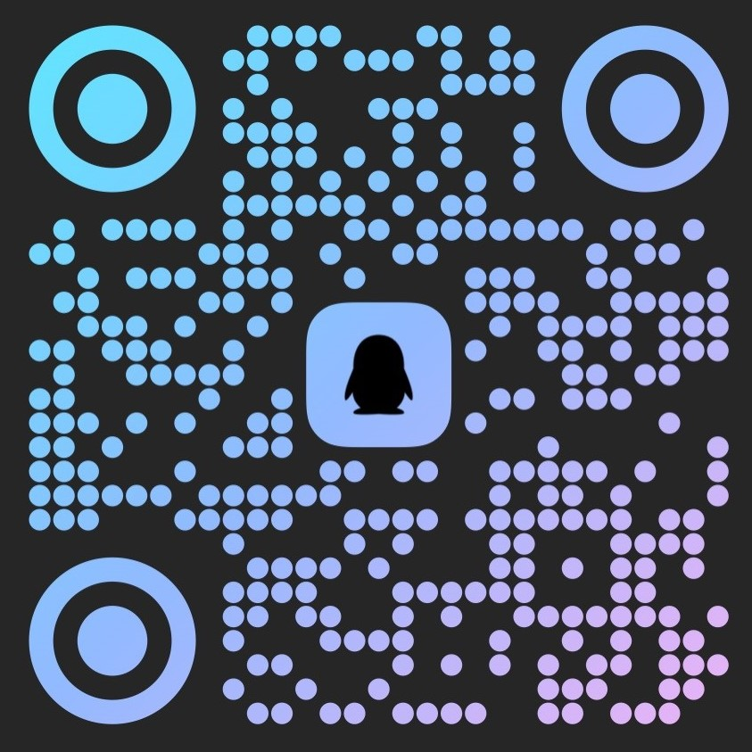
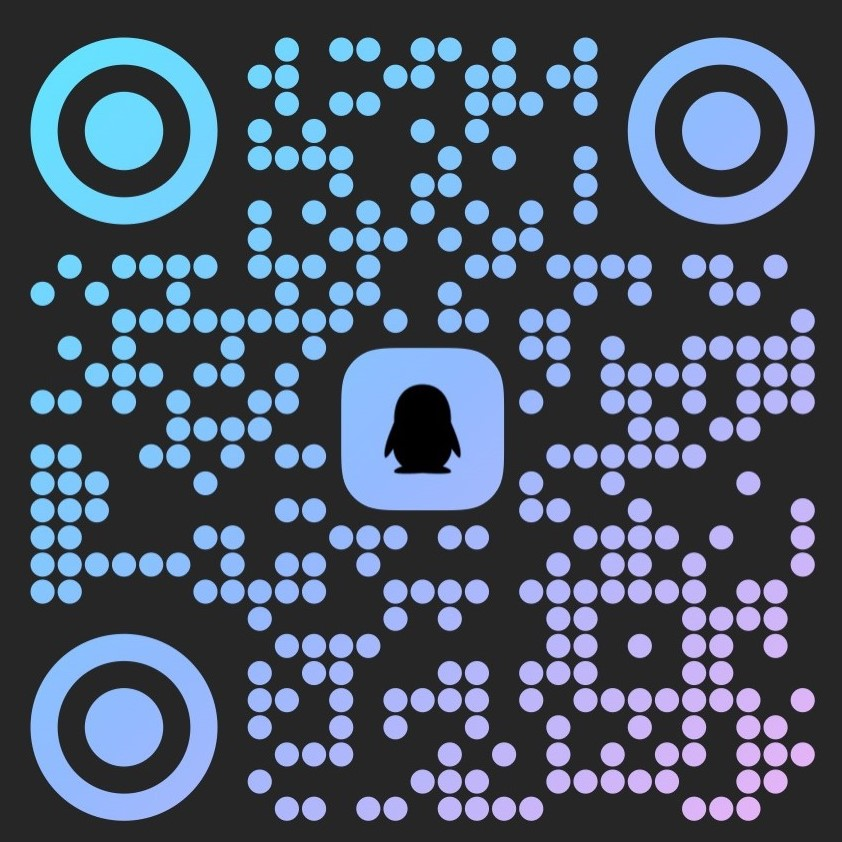

# N2Nmc  

### 简介
N2Nmc是N2N的一个图形化界面，可以用于各种局域网联机游戏

### 软件架构
本项目/仓库遵循 [GPL3.0](LICENSE) 协议

### 构建教程
暂无

### 项目引用 & 参与贡献
#### 开源项目
>[ntop - n2n](github.com/ntop/n2n) (GPL 3.0)

#### 开发者
>薛江彬 [薛江彬@gitee](gitee.com/xue-jiangbin)\
>LGF (LGF-Studio) [LGF@gitee](gitee.com/lgf-studio) \| [LGF@github](github.com/control0forver)

### 联系
#### N2Nmc交流群组 & 频道

| QQ交流群 主群 | QQ交流群 分群 ① | QQ频道 |
| :---: | :---: | :---: |
|  |  |  |
| 856112671 | 456045451 | 8128729wjw |

#### 联系开发者（加入开发）

| 开发者 | QQ | Email |
| :--- | :---: | :---: |
| 薛江彬 | 483188479 | 483188479@qq.com |
| LGF | 3239215385 | 3239215385@qq.com \| qwe3239215385@163.com |